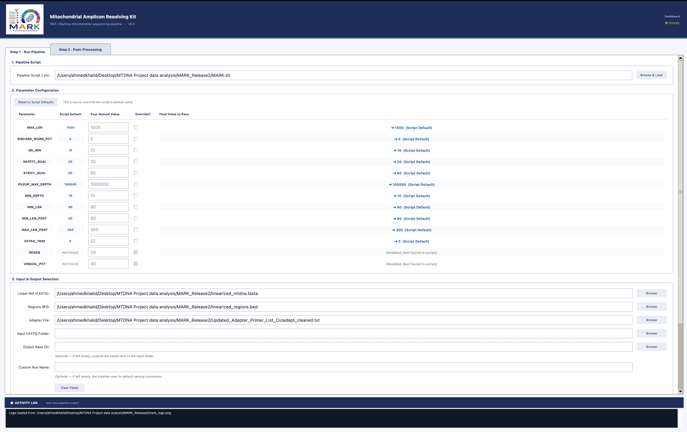

# MARK: Mitochondrial Amplicon Resolving Kit


**MARK** is a cross-platform bioinformatics suite designed to analyze targeted mitochondrial DNA (mtDNA) control-region data. It is specifically engineered to resolve overlapping amplicons, such as those generated by the **Promega PowerSeq™ CRM Nested System**.

MARK adapts Illumina-based chemistry workflows for both **Illumina** and **Oxford Nanopore Technologies (ONT)** sequencing platforms.

---

## Overview

MARK includes an automated Python GUI dashboard:



```bash
MARKLaunch.py
```

The dashboard drives two split-track shell pipelines:

| Pipeline | Platform | Input Type |
|---|---|---|
| `MARK.sh` | Oxford Nanopore Technologies | Long-read FASTQ data |
| `MARK-I.sh` | Illumina | Paired-end FASTQ data |

Both pipelines map reads to a **linearized mitochondrial reference** and split the analysis into two directly comparable tracks:

1. **Baseline Track**  
   Uses unmodified alignments.

2. **Trimmed Track**  
   Resolves overlapping amplicons by assigning reads to a primary amplicon using a maximum-overlap rule. The pipeline then applies CIGAR soft-clipping to enforce tiled amplicon boundaries, reducing internal gaps and overlap-driven artifacts.

---

## Key Features

- **GUI Dashboard**  
  `MARKLaunch.py` provides a unified interface for configuring variables, launching pipelines, and running post-processing tools.

- **Cross-Platform Support**  
  Handles both ONT long-read data and Illumina short-read paired-end data.

- **Diagnostic Split-Track Analysis**  
  Performs independent variant calling, annotation, and depth tracking for both the baseline and trimmed tracks. This allows direct comparison of how amplicon-boundary enforcement affects variant detection.

- **Amplicon-Aware Processing**  
  Uses a maximum-overlap rule to assign reads to their most appropriate amplicon and applies boundary-aware trimming to reduce overlap-related artifacts.

- **Automated Post-Processing**  
  Includes tools to convert linearized VCF coordinates back to standard circular rCRS positions and clean BAM headers for downstream review.

- **Debug-Friendly Outputs**  
  Produces multiple VCF layers, including raw, quality-filtered, SNP-only, cleaned, and homopolymer-focused outputs, allowing detailed review of variant behavior across processing stages.

---

## Installation

MARK can be installed through Conda when the package is available, or run directly from the GitHub source.

**Tested Installation:**
```bash
conda create -n mark_env -c conda-forge -c bioconda python=3.10 biopython fastp fastplong minimap2 bwa-mem2 bcftools cutadapt fastqc samtools -y
conda activate mark_env
git clone https://github.com/AKMARTIAN/MARK.git
cd MARK
python3 MARKLaunch.py
```

---

## Usage

**MARK** can be driven via the interactive GUI dashboard or run entirely from the command line for automation and advanced usage.

### Using the GUI Dashboard

Launch the interactive dashboard. After installing via Anaconda, `MARKLaunch.py` is on your `PATH` and can be run directly:

```bash
MARKLaunch.py
```

When running from a cloned source folder, launch it with Python from inside that folder:

```bash
python3 MARKLaunch.py
```

### Using the Command Line

The underlying bash pipelines (`MARK.sh` and `MARK-I.sh`) are fully standalone scripts. They can be executed directly from the terminal without the dashboard. This is useful for HPC environments, workflow managers, or users who prefer overriding parameters manually.

**⚠️ IMPORTANT NOTE ON COMMAND LINE USAGE:**
Running the pipeline scripts standalone **only produces the raw uncorrected outputs**. It does **not** automatically correct VCF positions to the circular reference, clean BAM headers, or organize the final files. To get the final corrected outputs, you must run the post-processing steps. You can do this by opening the `MARKLaunch.py` dashboard, navigating to the **Step 2: Post-Processing** tab, and running the steps sequentially on your output folder. Alternatively, you can use the **AUTO** feature in the dashboard to run the pipeline and post-processing together in one click.

Run either script with `--help` to see all available override options:

```bash
MARK.sh --help
MARK-I.sh --help
```

---

## Step 1: Run the Pipeline

From the main dashboard tab:

1. Select the appropriate pipeline script:
   - `MARK.sh` for ONT data
   - `MARK-I.sh` for Illumina paired-end data

2. Adjust pipeline parameters, including:
   - Quality thresholds
   - Minimum and maximum read length settings
   - Depth thresholds
   - Trimming variables

3. Select the required input files and folders:
   - Input FASTQ folder
   - Reference FASTA file
   - Amplicon or region BED file
   - Adapter/primer list

4. Click **Run Pipeline**.

---

## Step 2: Post-Processing

The second dashboard tab is used to finalize and organize the analysis outputs.

Post-processing includes:

1. **Organize Raw Output**  
   Sorts BAM and VCF files into their respective folders.

2. **Linear VCF Correction**  
   Converts variants called on the linearized mitochondrial reference back to standard circular rCRS coordinates.

3. **BAM Cleaning**  
   Cleans BAM headers and removes intermediate processing tags where required.

4. **Final Collection**  
   Packages the cleaned and corrected files into a final delivery folder.

The **Auto** button on the first tab can be used to run the selected pipeline and all four post-processing steps sequentially.

---

## Pipeline Workflow

MARK follows the general workflow below:

1. **Maximum Length Filtering**  
   Removes anomalous reads before core processing.

2. **Preprocessing**  
   Performs platform-specific preprocessing:
   - Illumina read merging where applicable
   - Quality filtering
   - Dual-pass 5′ and 3′ adapter/primer trimming using `cutadapt`

3. **Alignment**  
   Aligns reads against a linearized mitochondrial reference:
   - ONT: `minimap2`
   - Illumina: `bwa-mem2`

4. **Track Splitting**  
   Generates two analysis tracks:
   - Baseline BAM
   - Trimmed BAM processed using amplicon-boundary logic

5. **Variant Calling and Annotation**  
   Uses `bcftools` for ploidy-1 variant calling and annotates specific targets, including:
   - Homopolymer regions
   - Blacklist sites
   - Other predefined regions of interest

6. **VCF Export**  
   Produces distinct VCF outputs for debugging, comparison, and final interpretation, including:
   - Raw VCF
   - Quality-filtered VCF
   - SNP-only VCF
   - Cleaned VCF
   - Homopolymer-only VCF

---

## Output Structure

Each run creates a timestamped output folder (e.g. `MARK_<input>_<timestamp>_output/`), with one subfolder per sample. The post-processing steps then organize and finalize the results.

Typical outputs include:

```text
MARK_<input>_<timestamp>_output/
├── <sample>/                  # per-sample intermediates, QC, logs, and VCFs
├── sorted_bams/               # collected baseline/trimmed sorted BAMs
├── vcfs/                      # collected raw and filtered VCFs
├── run_summary.txt            # per-stage read-retention summary
└── Final_Pipeline_Results/
    ├── corrected_vcfs/        # VCFs converted back to circular rCRS coordinates
    └── cleaned_bams/          # header-cleaned BAMs
```

Exact folder names may vary depending on the run timestamp and selected pipeline.

---

## Main Scripts

| Script | Purpose |
|---|---|
| `MARKLaunch.py` | GUI dashboard for running pipelines and post-processing |
| `MARK.sh` | ONT mitochondrial amplicon pipeline |
| `MARK-I.sh` | Illumina mitochondrial amplicon pipeline |

---

## Notes

The baseline and trimmed tracks should be reviewed together when assessing variant behavior, especially in difficult regions such as homopolymers, amplicon overlaps, and primer-proximal positions.

An ONT test input fastq has been provided to test the pipeline with 'Test_M.fastq'.

---

## Recommended Output for Interpretation

The corrected cleaned VCF files in `Final_Pipeline_Results/corrected_vcfs/` are the main files intended for downstream comparison and review. Intermediate VCFs are retained for transparency and troubleshooting.

---

## Citation
If you use MARK, please cite this repository:
Omar, Ahmed K A. MARK: Mitochondrial Amplicon Resolving Kit. GitHub repository. https://github.com/AKMARTIAN/MARK
